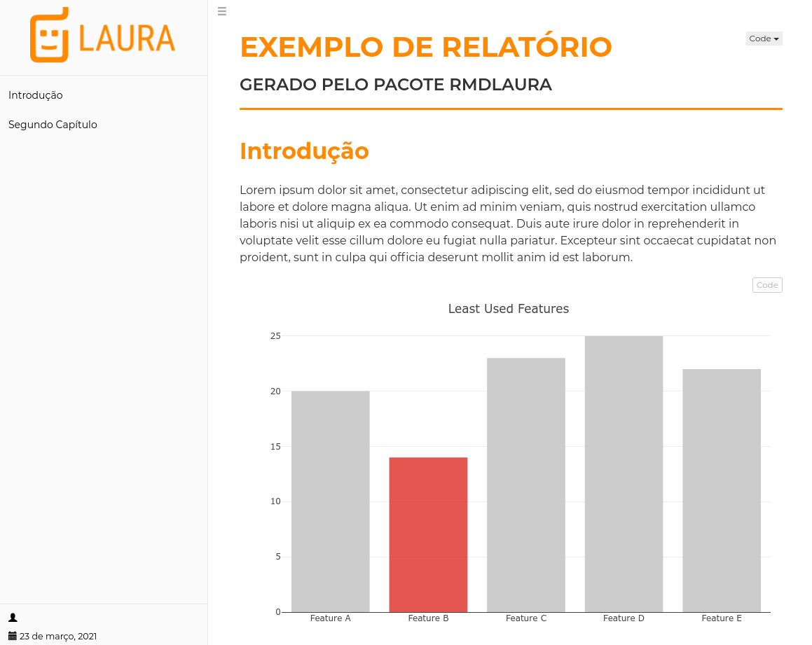

# rmdlaura
Template para gerar relatórios do Robô Laura em Rmarkdown, baseado no template *robobook* do pacote *rmdformats*

## Exemplo

[]()


## Instalação

```r
install.packages(remotes)  # if necessary
remotes::install_github("leonardokume/rmdlaura")
```
